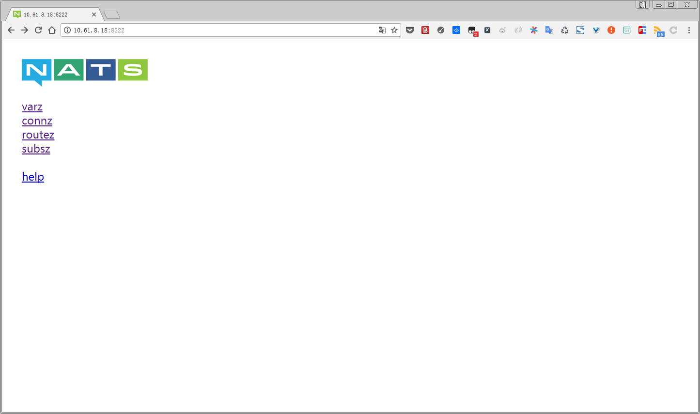
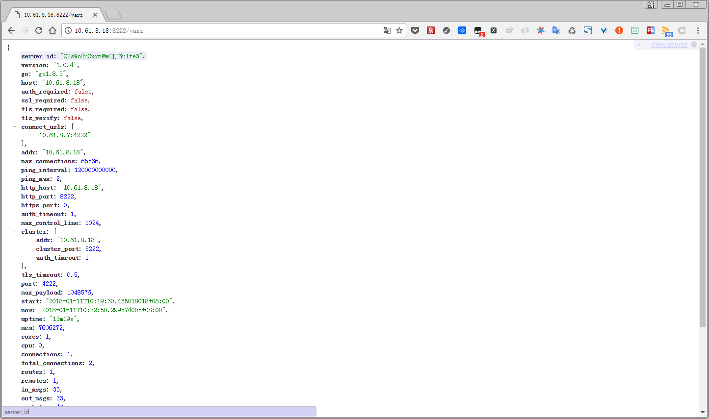

# nats-example

## 示例演示

集群环境搭建

```bash
gnatsd -a 10.61.8.7 -p 4222 -m 8222 -cluster nats://10.61.8.7:5222 -routes nats://10.61.8.10:5222,nats://10.61.8.18:5222 -DV

gnatsd -a 10.61.8.10 -p 4222 -m 8222 -cluster nats://10.61.8.10:5222 -routes nats://10.61.8.7:5222,nats://10.61.8.18:5222 -DV

gnatsd -a 10.61.8.18 -p 4222 -m 8222 -cluster nats://10.61.8.18:5222 -routes nats://10.61.8.7:5222,nats://10.61.8.10:5222 -DV
```

访问监控观察集群状态

http://10.61.8.7:8222

http://10.61.8.10:8222

http://10.61.8.18:8222





## Linux远程部署

```bash
mvn package
```

日志输出
```bash
[INFO] Scanning for projects...
[INFO] 
[INFO] ------------------------------------------------------------------------
[INFO] Building nats-example 1.0
[INFO] ------------------------------------------------------------------------
[INFO] 
[INFO] --- maven-resources-plugin:2.6:resources (default-resources) @ nats-example ---
[INFO] Using 'UTF-8' encoding to copy filtered resources.
[INFO] Copying 1 resource
[INFO] Copying 0 resource
[INFO] 
[INFO] --- maven-compiler-plugin:3.1:compile (default-compile) @ nats-example ---
[INFO] Nothing to compile - all classes are up to date
[INFO] 
[INFO] --- maven-resources-plugin:2.6:testResources (default-testResources) @ nats-example ---
[INFO] Using 'UTF-8' encoding to copy filtered resources.
[INFO] skip non existing resourceDirectory E:\workspace\joyplus\nats-example\src\test\resources
[INFO] 
[INFO] --- maven-compiler-plugin:3.1:testCompile (default-testCompile) @ nats-example ---
[INFO] Nothing to compile - all classes are up to date
[INFO] 
[INFO] --- maven-surefire-plugin:2.18.1:test (default-test) @ nats-example ---
[INFO] No tests to run.
[INFO] 
[INFO] --- maven-jar-plugin:2.6:jar (default-jar) @ nats-example ---
[INFO] Building jar: E:\workspace\joyplus\nats-example\target\nats-example-1.0.jar
[INFO] 
[INFO] --- spring-boot-maven-plugin:1.5.6.RELEASE:repackage (default) @ nats-example ---
[INFO] 
[INFO] --- wagon-maven-plugin:1.0:upload-single (upload-deploy) @ nats-example ---
[INFO] Uploading: E:\workspace\joyplus\nats-example\target\nats-example-2.0.jar scp://10.61.8.18/opt/nats-example-2.0.jar
[INFO] 
[INFO] --- wagon-maven-plugin:1.0:sshexec (upload-deploy) @ nats-example ---
[INFO] sshexec: pkill -f nats-example-2.0.jar


[INFO] sshexec: nohup java -jar /opt/nats-example-2.0.jar > /opt/nohup.out 2>&1 &


[INFO] ------------------------------------------------------------------------
[INFO] BUILD SUCCESS
[INFO] ------------------------------------------------------------------------
[INFO] Total time: 5.702 s
[INFO] Finished at: 2018-01-09T19:14:13+08:00
[INFO] Final Memory: 27M/332M
[INFO] ------------------------------------------------------------------------

Process finished with exit code 0
```

## 程序运行控制台


程序运行起来首先订阅了`some.nats.subject`,然后每隔5秒向`some.nats.subject`发布消息。从日志中可以看出`NATS`会尝试自动重连.

## 参考文章

https://nats.io/documentation/server/gnatsd-cluster/

https://github.com/cloudfoundry-community/java-nats/tree/master/client

https://nats.io/documentation/server/gnatsd-cluster/

http://gomqtt.taitan.org/user-guide/install/#nats

http://www.cnblogs.com/liang1101/category/975332.html

http://blog.csdn.net/chszs/article/category/5987039

https://github.com/ChinaSilence/spring-boot-starter-nats

http://xxgblog.com/2015/10/23/wagon-maven-plugin/